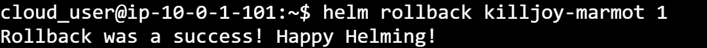

# Playbook Part 1 : Helm 2

## Basics of package management

Every operating sytem out there has some forms of package manager, such as Yum for Red Hat, Apt for Debian, there's Home brew for OS X and Chocolatey for Windows. The basics of package management are like the following : 


## Basics of Helm

Helm in Kubernetes like the following diagram : 


Basically, Helm has two parts, the helm client and tiller server, they're not necessarily to be in the same cluster, the client part can be in a remote server  :

- The **Helm Client** interacts with the tiller server, create and manages charts, packages charts into archives, interact with chart repositories, installs and uninstalls charts, manage chart release cycle.

- The **Tiller Server** listens for requests from the helm client, interacts with the Kubernetes API, manage releases, combien a chart and a config into a release, installs charts and track the release, upgrades and uninstalls charts. You can check the tiller in Kubernetes by using the following : 

   kubectl get pods --all-namespaces | grep tiller

## Install Helm 

The best teacher is at Github ( like always ) : https://github.com/helm/helm/blob/master/docs/install.md

Build command for Helm:

    make bootstrap build


After install helm in Kubernetes : 

    kubectl create serviceaccount --namespace kube-system tiller

    kubectl create clusterrolebinding tiller-cluster-rule --clusterrole=cluster-admin --serviceaccount=kube-system:tiller

    kubectl patch deploy --namespace kube-system tiller-deploy -p '{"spec":{"template":{"spec":{"serviceAccount":"tiller"}}}}'


You can also achieve this by deploying a yaml definition to enable the RBAC for your tiller : 

```yaml
apiVersion: v1
kind: ServiceAccount
metadata:
  name: tiller
  namespace: kube-system
---
apiVersion: rbac.authorization.k8s.io/v1
kind: ClusterRoleBinding
metadata:
  name: tiller
roleRef:
  apiGroup: rbac.authorization.k8s.io
  kind: ClusterRole
  name: cluster-admin
subjects:
  - kind: ServiceAccount
    name: tiller
    namespace: kube-system
 ```

## where these charts can be sources ? 

If you go to your local repository : 

    cd ./.helm/repostory 

So if you query the repositories.yaml file you'll find some repositories : 


Hence to wrap up the Helm charts are from :

- Offical repository which has been mentionned :  http://kubernetes-charts.storage.googleapis.com/
- Private repostories : such as some repos on GitHub or some cloud Storage providers etc..
- Local charts : helm create and helm fetch ( The diffrence is Helm create help you create helm charts from scratch on you own , HOWEVER helm fetch help you pull down some charts then you can work on these chart and turn them into your local chart, highly customized )


File structure of a chart : 

- Charts ( folder )
- Chart.yaml  # A yaml file that contains information about the chart
- README.md
- requirements.lock
- requirements.yaml ( optional file that lists dependencies for that chart, and the dependencies are actually packaged in charts folder )
- templates ( folder,  actually templates that combines with values to generate Kubernetes Manifest files )
- values.yaml ( contains the default configuration values for the chart, this is where helm grabs the values for the manifest template where contains the reference values )

## Create your own Helm charts

If you gonna create your own helm chart , you can use the following command : 

    helm create meloncharts

Some folders and files will be created from scratch :

- Charts ( folder )
- Chart.yaml
- templates ( folder )
- values.yaml

If you gonna pull down some charts locally, you can use for example :

    helm fetch stable/jenkins    # Here stable is the repostory name

Then you'll see you have jenkins-xxx.tgz in your repo, you can go then install it locally by using : 

    helm install ./helmcharts/jenkins-xxx.tgz

## In action :

Check the helm home space : 

    helm home 

The output should be something like this : 

    /home/cloud_user

Check the version of Helm:

    helm version

If you're using Helm 2, the output will cover the version information for both client and server. 

First start to use Helm, you have to initialise ( install tiller ) using the following command :

    helm init 

  Upgrade if Tiller is already installed, you can use the following : 
  
   helm init --upgrade  

To query the helm charts has been deployed : 

    helm ls

If you simply want the name, you can do this : 

   helm ls --short

To query helm chart are available : 

    helm list

To install the Helm charts 

    helm install stable/melonchart

You can also deploy a specific version : 

    helm install stable/melonchart --version 0.0.7

After entering this command, the output of the command will show how it deploy in Kubernetes :

Usually in **default** namespace, related resource including : Secret / ConfigMap / PVC / Service / Deployment / StatefulSet ( MariaDB )

If you need to search for a Chart, you can use : 

     helm search chartname

Check the depedencies by using the following : 

     helm dep list

Update the dependencies :

     helm dep update

Dependencies are in requirements.yaml

To inspect a helm chart is ( kind of like kubectl decribe in K8S which including all the configurable value ): 

     helm inspect melon/chart 

Delete a helm chart has been deployed using the following : 

     helm delete melonchart

Whenever you install a chart, a new release is created. So one chart can be installed multiple times into the same cluster. And each can be independently managed and upgraded. To upgrade a release to a specified version of a chart and/or updates chart values :

    helm upgrade [RELEASE] [CHART_path] [flags]
Example :

    helm upgrade melon-release ~/melonchart


Check the history of the releases : 

    helm history melonreleasechart

Sample output is like the following :



Roll back to a specific version 

    helm rollback melon-release 2

Roll back to previous version 

    helm rollback melon-release 0

Additionally, you can use the following commands : 

Go back to the initial deployment : 

     helm rollback 1   

Go back to teh 

Sample output is like the following : 


## Custom Charts

You can override values one time during the install command by using **--set** flag :

     helm install --name storage-release --set persistence.storageClass=xx-block


Or fetch the chart and modify the **values.yaml** file, then pass a values.yaml file on the install command line. This allow me to consolidate all of the deployment I would do for an application in one place. 


To add Custom charts to the repo :

     helm repo add melonchart https://raw.githubusercontent.com/melonchart/helmcharts/master


Really useful tips for using values and if you want to check the value that your helm chart is using at runtime, you can use the following command : 

     helm get values --all melon-release

## Find more Helm commands 

    https://helm.sh/docs/helm/